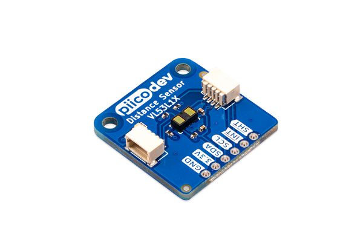

# PiicoDev Distance Sensor VL53L1X

This is the repo for the [PiicoDev® Distance Sensor](https://core-electronics.com.au/catalog/product/view/sku/CE07741) PCB.

The PiicoDev® Distance Sensor is a long-distance laser-ranging sensor that uses Time-of-Flight (ToF) to accurately measure distances up to 4m.

- Small size, millimetre precision
- Can be protected behind many cover-window materials.
- PiicoDev connector, compatible with Qwiic and STEMMA QT (3.3V only)
- 2.54mm breakout for breadboarding/prototyping
- Manufactured and [supported](https://core-electronics.com.au/contacts/) in Australia by Core Electronics

# License
This project is open source - please review the LICENSE.md file for further licensing information.

If you have any technical questions, or concerns about licensing, please contact technical support on the [Core Electronics forums](https://forum.core-electronics.com.au/).

# Attribution
The hardware design of this module is influenced by the design from Sparkfun ([repo](https://github.com/sparkfun/Qwiic_Distance_VL53L1X)).

*\"PiicoDev\" and the PiicoDev logo are trademarks of Core Electronics Pty Ltd.*
